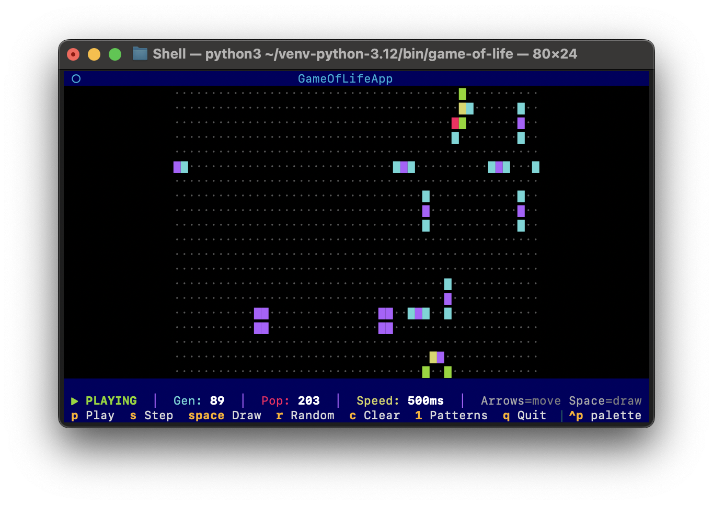

# README Visual Guide

## How the GitHub README Looks Now

### Header Section
```
┌─────────────────────────────────────────────┐
│                                             │
│         [Cute Colorful Grid Logo]           │
│          (300px wide, centered)             │
│                                             │
│        # Game of Life TUI                   │
│                                             │
│  A beautiful, interactive terminal-based... │
│                                             │
│  [Python 3.8+] [MIT License] [PyPI]         │
│  (badges)                                   │
│                                             │
│  Installation • Features • Controls • Docs  │
│  (navigation links with emoji)             │
│                                             │
└─────────────────────────────────────────────┘
```

### Screenshot Section
```
───────────────────────────────────────────────

## 📸 Screenshot

┌─────────────────────────────────────────────┐
│                                             │
│    [Terminal Screenshot - Full Width]       │
│    Shows colorful cells in rainbow colors   │
│    with status bar and controls             │
│                                             │
│  Watch cells evolve through rainbow colors  │
│  cyan (newborn) → green → yellow →          │
│  magenta → blue (ancient)                   │
│                                             │
└─────────────────────────────────────────────┘

───────────────────────────────────────────────
```

### Rest of README
- Features (with emoji bullets)
- Installation instructions
- Quick start guide
- Comprehensive controls tables
- Color guide with rainbow emoji
- Theme support
- Examples & tips
- Documentation links
- Project structure
- Contributing guidelines
- And more!

## Visual Hierarchy

1. **Logo** (300px) - Immediate visual identity
2. **Title** - Clear project name
3. **Description** - One-line pitch
4. **Badges** - Quick info (Python, License, PyPI)
5. **Navigation** - Jump to sections
6. **Screenshot** - Full demo with caption
7. **Content** - Detailed sections

## Why This Layout Works

### Logo at Top
- ✅ **Memorable** - Cute, colorful, represents the project
- ✅ **Professional** - Shows polish and attention to detail
- ✅ **Brand Identity** - Users recognize it instantly
- ✅ **Sized Right** - 300px is perfect for GitHub

### Screenshot with Caption
- ✅ **Separate Section** - Gets its own spotlight
- ✅ **Full Width** - Shows terminal in action
- ✅ **Descriptive Caption** - Explains the rainbow colors
- ✅ **Centered** - Draws the eye

### Navigation Links
- ✅ **With Emoji** - Matches section headers
- ✅ **Quick Access** - Jump to any section
- ✅ **Clean** - Separated by bullets

## Image Files

Both images are now in `assets/`:

```
assets/
├── logo.png       (638K) - Colorful grid character
└── screenshot.png (480K) - Terminal screenshot
```

## Markdown Used

### Logo
```markdown

```
- Sized to 300px for good balance
- Centered with `<div align="center">`

### Screenshot
```markdown


*Watch cells evolve through rainbow colors...*
```
- Full width (no size restriction)
- Italic caption below

## GitHub Rendering

When pushed to GitHub, this will look:

1. **Top**: Cute logo greets visitors
2. **Badges**: Quick validation (Python version, license)
3. **Navigation**: Easy access to sections
4. **Screenshot**: Full demo of the actual TUI
5. **Content**: Everything else below

## Comparison: PyPI vs GitHub

### README_PYPI.md
- ❌ No logo (PyPI rendering is limited)
- ❌ No screenshot
- ✅ Simple badges
- ✅ Quick tables
- ✅ Concise content

### README.md
- ✅ Logo at top
- ✅ Full screenshot with caption
- ✅ Rich formatting with emoji
- ✅ Comprehensive content
- ✅ Beautiful layout

## Preview Tips

To preview locally before pushing:

1. **VS Code**: Install "Markdown Preview Enhanced"
2. **GitHub**: Use GitHub's preview when editing
3. **Grip**: Install `pip install grip` then `grip README.md`

## Final Result

Your GitHub README now has:
- 🎨 Beautiful logo at the top
- 📸 Impressive screenshot showing the TUI
- 🌈 Clear explanation of rainbow colors
- 📚 Comprehensive documentation
- 🚀 Professional presentation

Perfect for attracting users and contributors! ✨
